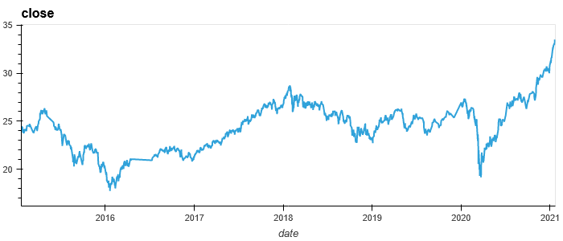
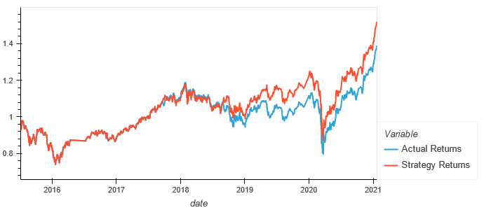
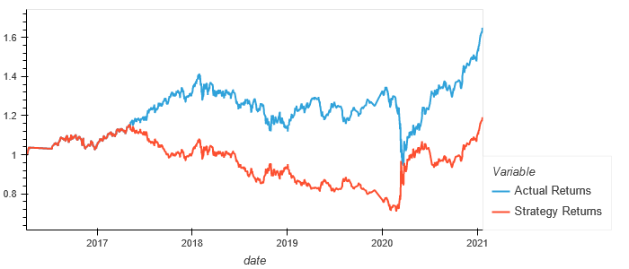
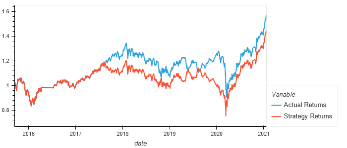
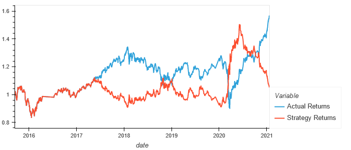

# Algorithmic Trading Bot
Algorithmic trading bot that enhance the existing trading signals using machine learning algorithms to maximize a strategy return.

## Establish a Baseline Performance

This analysis tool starts by ingesting OHLCV datasets. Once ingested, the data is used to create a short and long-window SMA values followed by generating a trading signal.

Here's an example of our OHLCV datasets.

The new dataset is then split into training and testing dataset before getting fit to a support vector machine (SVM) learning method to create a rigourous model that predicts and review predictions. 

Once the prediction dataframe is created we run a cumulative return plot that shows the actual returns vs. the strategy returns.

See the result from our strategy return.

To summarize our first prediction, using the SVM model with a SMA of 4/100 (short/long window) returned a 55% accuracy based on the classification report. If we compare to the relative frequencies of the Signal (`value_counts(normalize=True)`) with the precision of our classification report it brings us to a conclusion that there was very little to no value added from our strategy in terms of precisions.
The positive outcome, looking at the vizualisation, is that we can see that our prediction model returned more than our actual returns. 

For this preliminary conclusion, our original baseline model returned a good strategy. The baseline strategy did returned a positive outcome compare the actual returns.

## Tune the Baseline Trading Algorithm

The first sections layed down a first case (baseline) to compare too as we're moving towards our following step - tuning the trading algorithm.

To do so we started by slicing our data into a different (July 2015 to April 2016) and longer period (3 months vs 9 months)

Re-ran the prediction from offseting and increasing the training window. The result can be visualized from this captured image.

The classification report showed a decrease in accuracy (52% vs 55%) and a slight increase in precision (1% to 2%) compared to our baseline.
From our visualization we can add that our strategy return showed a signicant decrease from our baseline and actual return.

Next, we adjusted the short window of the SMA (50 instead of 4 for our short and 200 instead of 100 for our long from our baseline).  
Once again, ran the prediction with the revised SMA. The result can be visualized from this captured image.

Our 3rd prediction classification report showed lower accuracy (54% vs 55%) from our baseline.
From our visualization we can add that our strategy return showed a slight decrease from our baseline and actual return but performed better than our second prediction.

## Evaluate a New Machine Learning Classifier

Using the original parameters we then moved to fit the baseline to the performance of a Logistic Regression machine learning model and backtest it to evaluate it's performance. 

The new model performed worst that the baseline model. The prediction classification report showed lower accuracy (49% vs 55%) from our baseline.
From our visualization we conclude that our strategy return did worst that  our baseline and any of the tuned trading algorithm.

## Summary Evaluation Report

Looking back at the different set of parameters that returned the best accuracy, precision and Strategy returns we conclude that our baseline scored best.

At this preliminary stage of the analysis tool and after looking back at the results it would be our recommandation to continue our exploration of different parametters and supervised machine learning classification techniques such as "AdaBoost" or "Decision Tree Based Algorithms" in order to increase the strategy returns.

----------

## Contributors

This application originated from a Berkeley Bootcamp.

For any inquieries, feedbacks or comments about this project please email me at  [yanickw@gmail.com](mailto:yanickw@gmail.com)

I can also be reached on  [LinkedIn](https://www.linkedin.com/in/yanickwilisky/)  or  [Twitter](https://twitter.com/yanickwilisky).

----------

## License

MIT License

Copyright (c) 2022 Yanick Wilisky

Permission is hereby granted, free of charge, to any person obtaining a copy of this software and associated documentation files (the "Software"), to deal in the Software without restriction, including without limitation the rights to use, copy, modify, merge, publish, distribute, sublicense, and/or sell copies of the Software, and to permit persons to whom the Software is furnished to do so, subject to the following conditions:

The above copyright notice and this permission notice shall be included in all copies or substantial portions of the Software.

THE SOFTWARE IS PROVIDED "AS IS", WITHOUT WARRANTY OF ANY KIND, EXPRESS OR IMPLIED, INCLUDING BUT NOT LIMITED TO THE WARRANTIES OF MERCHANTABILITY, FITNESS FOR A PARTICULAR PURPOSE AND NONINFRINGEMENT. IN NO EVENT SHALL THE AUTHORS OR COPYRIGHT HOLDERS BE LIABLE FOR ANY CLAIM, DAMAGES OR OTHER LIABILITY, WHETHER IN AN ACTION OF CONTRACT, TORT OR OTHERWISE, ARISING FROM, OUT OF OR IN CONNECTION WITH THE SOFTWARE OR THE USE OR OTHER DEALINGS IN THE SOFTWARE.

